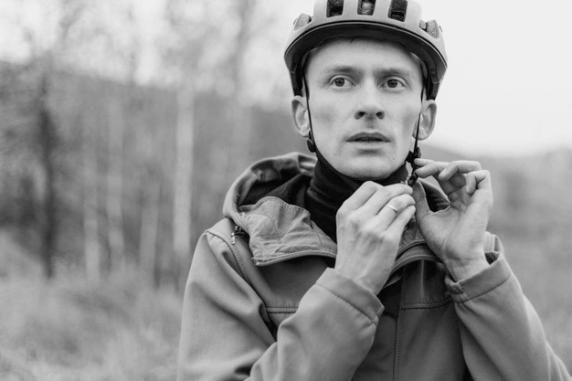
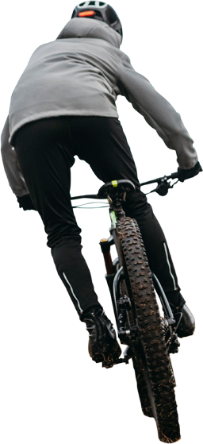
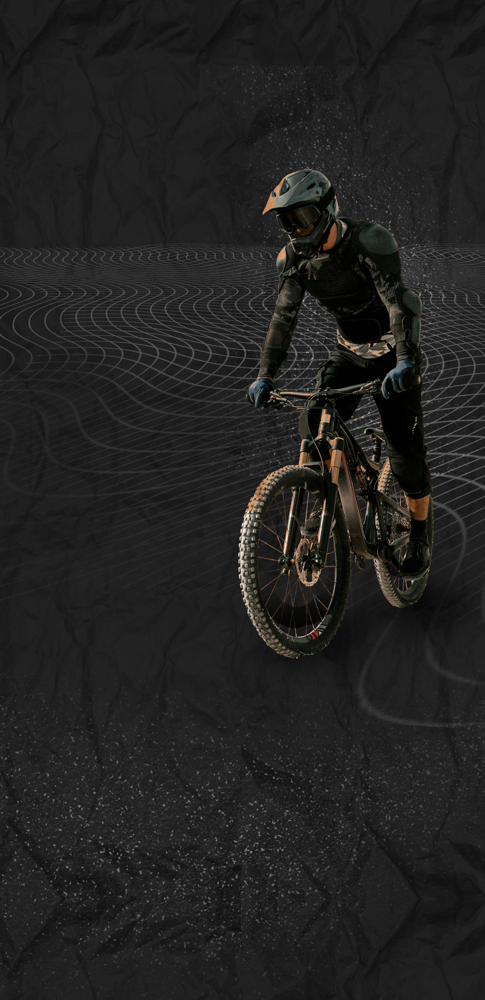
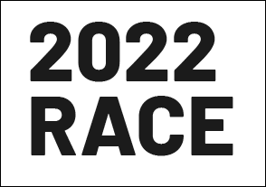

<!DOCTYPE html>
<html lang="ru">
<head>
<meta charset="UTF-8" />
<meta name="viewport" content="width=device-width, initial-scale=1.0"/>
<title>VELO RACE X</title>

</head>

<body>

<!-- PARTICLES -->

<!-- HERO -->
<header class="hero">

    <!-- ВСТАВЬ СВОЕ ВИДЕО ИЛИ КАРТИНКУ -->
    

    

    

        <h1>VELO RACE X</h1>
        
Скорость. Адреналин. Легенды велогонок.

        <a href="#gallery" class="btn">Смотреть гонки</a>
    

</header>

<!-- MARQUEE -->

    <h2>
        ⚡ BIKE RACING ⚡ EXTREME SPEED ⚡ CHAMPIONS ⚡ DOWNHILL ⚡
    </h2>

<!-- RIDERS -->
<section>

    <h2 class="title">ТОП ГОНЩИКИ</h2>

    

        

            
            

                <h3>Speed Hunter</h3>
                
Безумная скорость и опасные трассы.

            

        

        

            
            

                <h3>Night Rider</h3>
                
Гонки ночью под неоновыми огнями.

            

        

        

            
            

                <h3>Mountain King</h3>
                
Экстремальные спуски и прыжки.

            

        

    

</section>

<!-- PARALLAX -->
<section class="parallax">
    
    <h2>NO LIMITS</h2>
</section>

<!-- SECTION INFO RACES -->
<section id="races">

    <h2 class="title">ЛЕГЕНДАРНЫЕ ГОНКИ</h2>

    

        <!-- CARD 1 -->
        

            

            

                
            

            

                01

                <h3>DOWNHILL MADNESS</h3>

                

                    Самые опасные спуски в мире.
                    Скорость более 90 км/ч.
                    Гонщики летят через скалы,
                    грязь и огромные трамплины.
                

                

                    

                        <h4>95 KM/H</h4>
                        МАКС СКОРОСТЬ
                    

                    

                        <h4>12 KM</h4>
                        ТРАССА
                    

                    

                        <h4>EXTREME</h4>
                        УРОВЕНЬ
                    

                

            

        

        <!-- CARD 2 -->
        

            

            

                
            

            

                02

                <h3>NEON NIGHT RIDE</h3>

                

                    Ночные городские гонки под
                    неоновыми огнями мегаполиса.
                    Адреналин, скорость и
                    полное безумие.
                

                

                    

                        <h4>80 KM/H</h4>
                        СКОРОСТЬ
                    

                    

                        <h4>URBAN</h4>
                        ГОРОД
                    

                    

                        <h4>NIGHT</h4>
                        РЕЖИМ
                    

                

            

        

        <!-- CARD 3 -->
        

            

                
            

            

                03

                <h3>MOUNTAIN KINGS</h3>

                

                    Гонки по горным вершинам,
                    где один неверный поворот
                    решает всё.
                

                

                    

                        <h4>3000M</h4>
                        ВЫСОТА
                    

                    

                        <h4>HARDCORE</h4>
                        РЕЖИМ
                    

                    

                        <h4>ICE WIND</h4>
                        ПОГОДА
                    

                

            

        

    

</section>

<!-- FOOTER -->
<footer>
    <h2>VELO RACE X © 2022</h2>
    
Самые безумные гонки велосипедистов.

</footer>

</body>
</html>
